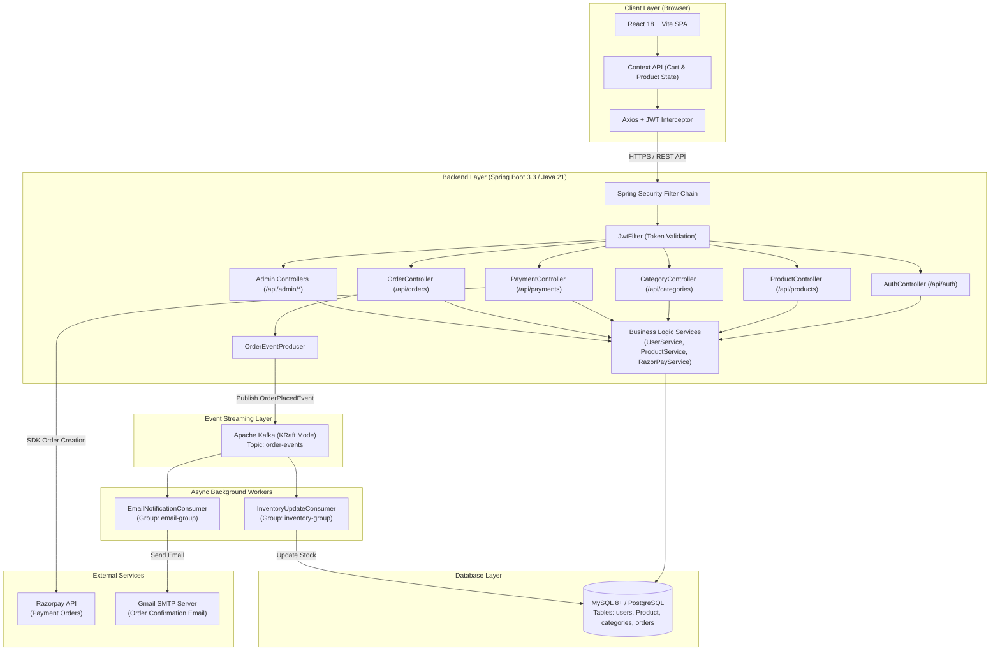
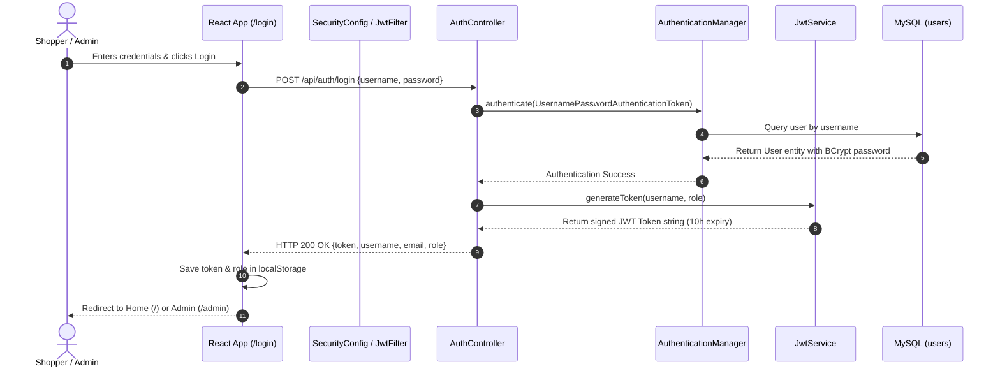
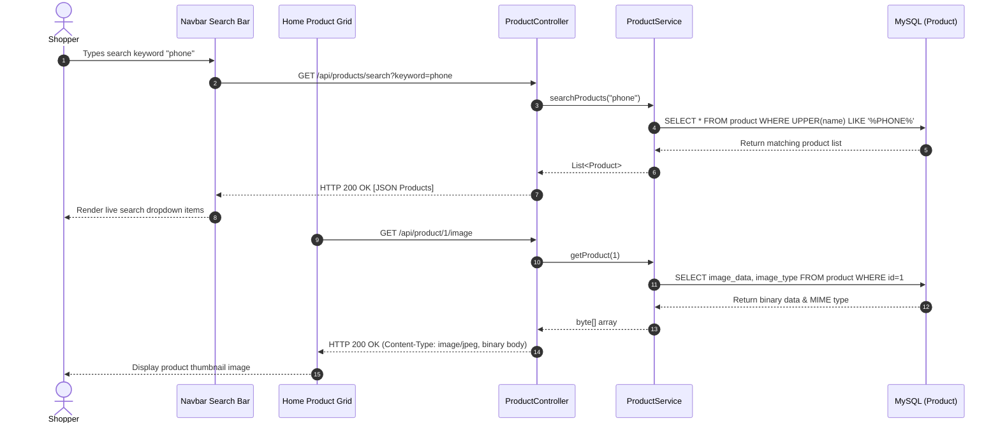
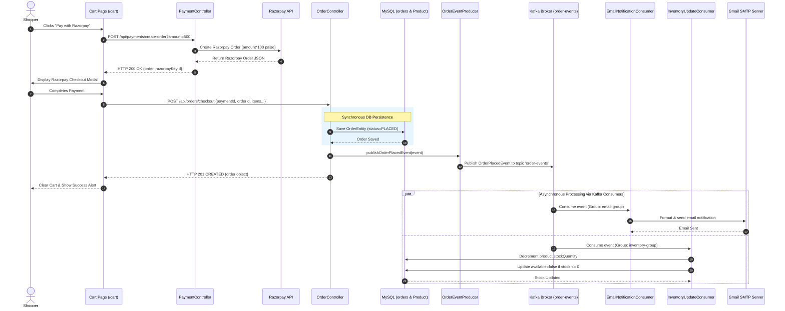
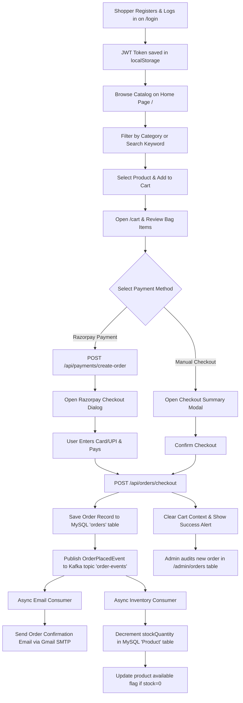

# 🛒 Full-Stack E-Commerce Application — Comprehensive Project Documentation

---

## 1. Project Overview

### What is this project?
The **Full-Stack E-Commerce Application** is a production-ready, multi-role online retail platform designed to deliver a seamless shopping experience for customers while giving administrators complete control over inventory, catalog categories, user accounts, and customer orders. It is engineered using **Spring Boot 3 (Java 21)** on the backend and **React 18 with Vite** on the frontend, supported by an **Apache Kafka (KRaft mode)** event-streaming pipeline for asynchronous notifications and inventory management.

### What business problem does it solve?
In modern retail e-commerce, monolithic order processing can introduce latency, race conditions during stock reduction, and poor user experience when checkout operations wait synchronously for external services (like sending emails). 
This application solves key e-commerce challenges:
1. **Decoupled Asynchronous Processing:** Offloads stock updates and order confirmation email delivery to background Kafka consumers, ensuring fast checkout response times.
2. **Secure Multi-Role Access:** Enforces strict role-based separation between shoppers (`USER`) and store operators (`ADMIN`).
3. **Automated Inventory Tracking:** Prevents overselling by calculating real-time product availability based on stock counts and automatically marking items as out-of-stock when quantities hit zero.
4. **Integrated Payment & Checkout Flexibility:** Supports seamless payment collection via **Razorpay** as well as direct order placement fallback for testing and offline transactions.

### Who are the intended users?
* **Shoppers / Customers (`USER` role):** Individuals who browse products, filter by category, perform live text searches, add items to a persistent cart, and purchase items using Razorpay or manual checkout.
* **Store Administrators (`ADMIN` role):** Store managers who create, edit, and delete product listings (with image binary uploads), manage product categories, review user accounts, and monitor customer orders across the platform.
* **Guests / Visitors:** Unauthenticated users who reach the landing page and are routed to the login/registration screen to securely authenticate before accessing shopping features.

### What are the core features?
* **JWT Stateless Authentication & Authorization:** Secure registration and dual-tab login (User vs. Admin) powered by BCrypt password hashing and JWT authorization tokens.
* **Product Catalog & Category Browsing:** Interactive grid displaying product cards with image previews, category filtering, price displays, and stock badges.
* **Live Keyword Search:** Instant, real-time product search matching product titles and descriptions.
* **Persistent Cart & Dynamic Calculation:** Client-side cart backed by React Context and `localStorage`, with live price calculations and quantity limit checks against available stock.
* **Dual Checkout Engine:** Integrated **Razorpay** payment gateway for payment collection and **Manual Checkout** mode for immediate order registration.
* **Event-Driven Micro-Architecture (Kafka KRaft):** Event producer (`OrderEventProducer`) publishing `OrderPlacedEvent` messages consumed independently by:
  * `EmailNotificationConsumer` (Sends order confirmation emails via SMTP).
  * `InventoryUpdateConsumer` (Reduces product stock quantities in real time).
* **Comprehensive Admin Control Panel (`/admin`):**
  * **Category CRUD:** Add, rename, and remove categories.
  * **Product CRUD:** Add/edit products with multipart binary image upload (`LONGBLOB`).
  * **User Management:** View all user accounts and remove non-admin users.
  * **Order Tracking:** Real-time table of all customer orders with auto-refresh every 5 seconds.

### Complete Workflow from User Perspective

```
[ Visitor / Shopper ]
        │
        ▼
   Open App (http://localhost:5173) ──► Redirected to /login
        │
        ├── Register new account (Username, Email, Password)
        │
        └── Select "User Login" ──► Enter Credentials ──► Receive JWT Token
                │
                ▼
           Home Page (/)
                │
                ├── Filter by Category / Live Keyword Search
                ├── Click Product Card ──► View Details (/product/:id)
                └── Click "Add to Cart" ──► Item added to Cart Context & localStorage
                        │
                        ▼
                   Cart Page (/cart)
                        │
                        ├── Adjust item quantities or remove items
                        │
                        ├── Choose Checkout Method:
                        │     ├── [ Option A: Pay with Razorpay ]
                        │     │      └─► Opens Razorpay Payment Modal ──► Success Callback
                        │     │
                        │     └── [ Option B: Manual Checkout ]
                        │            └─► Opens Checkout Summary Modal ──► Confirm Order
                        │
                        ▼
                 POST /api/orders/checkout
                        │
                        ├── Backend saves Order record to DB (`orders` table)
                        ├── Publishes `OrderPlacedEvent` to Kafka topic `order-events`
                        │
                        ├── [ Async Consumer 1 ] EmailNotificationConsumer ──► Confirmation Email sent
                        └── [ Async Consumer 2 ] InventoryUpdateConsumer  ──► Stock reduced in DB
                                │
                                ▼
                       Order Complete & Stock Updated
```

---

## 2. High-Level Architecture

### Architecture Description
The system is built as a modern, decoupled single-page application (SPA) backed by a RESTful Spring Boot microservice stack and an event streaming bus.

* **Frontend:** Built with **React 18** and **Vite 5**. Utilizes **React Router DOM v6** for client-side routing, **Bootstrap 5** and **Bootstrap Icons** for responsive styling, and **Axios** with request/response interceptors to attach `Authorization: Bearer <JWT>` headers and handle automatic 401/403 redirects.
* **Backend:** Built on **Spring Boot 3.3** using **Java 21**. Features **Spring Security** configured for stateless JWT session management, **Spring Data JPA** with Hibernate for object-relational mapping, and **Jackson** for JSON serialization.
* **Database Layer:** Primary database is **MySQL 8+** (or switchable to **PostgreSQL**). JPA automatically manages table schemas (`users`, `Product`, `categories`, `orders`) with `ddl-auto=update`. Product images are stored directly in the database as binary `LONGBLOB` data.
* **Event Bus (Apache Kafka KRaft):** Apache Kafka running in ZooKeeper-less KRaft mode. When an order is finalized, the backend publishes an `OrderPlacedEvent` payload to the `order-events` topic. Two independent consumer groups (`email-group` and `inventory-group`) process this event concurrently.
* **External Services:**
  * **Razorpay Payment Gateway:** Server-side order creation via Razorpay Java SDK (`com.razorpay:razorpay-java`) and client-side checkout modal script (`checkout.js`).
  * **SMTP Email Server (Gmail):** Transactional email delivery managed by **Spring Mail** (`JavaMailSender`).

### Architecture Diagram (Mermaid)



---

## 3. Complete User Journey

```
User opens website (http://localhost:5173)
        ↓
App checks localStorage for 'token'
        ↓
No token found → UserRoute / AdminRoute redirects to /login
        ↓
User selects "User Login" or "Create Account"
        ↓
User enters registration details (Username, Email, Password) → POST /api/auth/register → DB saves user with BCrypt password
        ↓
User enters credentials → POST /api/auth/login → Server returns JWT token & user details
        ↓
Frontend saves token, username, email, role in localStorage → Redirects to Home Page (/)
        ↓
Home Page loads catalog → GET /api/products → Renders product grid with image previews (GET /api/product/{id}/image)
        ↓
User filters by category via Navbar dropdown → GET /api/categories → Catalog displays matching items
        ↓
User types in Search bar → GET /api/products/search?keyword=... → Real-time search suggestions display
        ↓
User clicks product card → Navigates to /product/:id → GET /api/product/{id} → Renders full details, price, description, stock count
        ↓
User clicks "Add to Cart" → Cart Context updates → Item added to localStorage 'cart'
        ↓
User clicks Cart icon → Navigates to /cart → Displays item list, unit prices, quantity buttons, and Grand Total
        ↓
User clicks "Pay with Razorpay" OR "Checkout (Manual)"
        ├───────────────────────────────────────────────────────┐
        ▼                                                       ▼
[ Pay with Razorpay ]                                    [ Manual Checkout ]
        ↓                                                       ↓
POST /api/payments/create-order                          User reviews order summary in modal
        ↓                                                       ↓
Backend calls Razorpay SDK → Returns order ID            User clicks "Confirm Checkout"
        ↓                                                       ↓
Client opens Razorpay payment modal                     POST /api/orders/checkout
        ↓                                                       ↓
User completes payment → Success callback                Order saved to DB (`orders` table)
        ↓                                                       ↓
POST /api/orders/checkout                               Kafka event published to `order-events`
        ├───────────────────────────────────────────────────────┘
        ▼
Backend processes order checkout:
1. Saves OrderEntity record to MySQL database (`status = PLACED`)
2. Sends direct email backup (if SMTP configured)
3. OrderEventProducer emits `OrderPlacedEvent` payload to Kafka
        ↓
Kafka processes event concurrently:
├── EmailNotificationConsumer → Formats confirmation email → Dispatches email via Gmail SMTP
└── InventoryUpdateConsumer → Fetches product record → Reduces stock quantity → Marks available=false if stock hits 0
        ↓
Frontend clears Cart Context & localStorage → Displays success alert → Product stock badge updates automatically
```

---

## 4. Complete Feature Breakdown

### 1. JWT Authentication & Role-Based Security
* **Purpose:** Provides secure user registration, password hashing, stateless token generation, and role enforcement.
* **Who uses it:** All users (Shoppers & Administrators).
* **Inputs:** Registration payload (`username`, `password`, `email`) or Login payload (`username`, `password`).
* **Outputs:** JWT authorization token string, user role (`USER` or `ADMIN`), email, username.
* **Dependencies:** Spring Security, BCryptPasswordEncoder, JJWT library, `UserRepo`.
* **Connected Pages:** `/login`.
* **Connected APIs:** `POST /api/auth/register`, `POST /api/auth/login`.
* **Database Tables Used:** `users`.

### 2. Product Catalog Browsing & Category Filtering
* **Purpose:** Enables customers to view all active products, image thumbnails, pricing, and filter items by specific categories.
* **Who uses it:** Shoppers (`USER` role).
* **Inputs:** Selected category name (optional filter).
* **Outputs:** Array of product objects with image blob URLs.
* **Dependencies:** `ProductService`, `CategoryService`, `ProductRepo`, `CategoryRepo`.
* **Connected Pages:** `/` (Home), `Navbar`.
* **Connected APIs:** `GET /api/products`, `GET /api/product/{id}/image`, `GET /api/categories`.
* **Database Tables Used:** `Product`, `categories`.

### 3. Real-Time Product Keyword Search
* **Purpose:** Allows shoppers to quickly locate items by searching titles, descriptions, and brands.
* **Who uses it:** Shoppers (`USER` role).
* **Inputs:** Search keyword string (`keyword`).
* **Outputs:** Filtered list of matching product objects.
* **Dependencies:** `ProductService`, `ProductRepo` (JPQL search query).
* **Connected Pages:** `Navbar` (Search input dropdown).
* **Connected APIs:** `GET /api/products/search?keyword={keyword}`.
* **Database Tables Used:** `Product`.

### 4. Cart Management & Quantity Validation
* **Purpose:** Manages item selections, prevents ordering more items than available in stock, and calculates live order totals.
* **Who uses it:** Shoppers (`USER` role).
* **Inputs:** Product object, quantity adjustments, item removals.
* **Outputs:** Updated cart array, persistent `localStorage` cart state, computed total price.
* **Dependencies:** React Context (`AppContext`), Browser `localStorage`.
* **Connected Pages:** `/cart`, `/product/:id`, `/`.
* **Connected APIs:** `GET /api/products`, `GET /api/product/{id}/image`.
* **Database Tables Used:** `Product` (for real-time price & stock verification).

### 5. Razorpay Payment Gateway Integration
* **Purpose:** Processes credit/debit card, UPI, and net-banking payments securely through Razorpay's infrastructure.
* **Who uses it:** Shoppers (`USER` role).
* **Inputs:** Order amount, currency (INR), receipt ID.
* **Outputs:** Razorpay Order ID, Razorpay Payment ID signature.
* **Dependencies:** Razorpay Java SDK (`RazorpayClient`), Razorpay JS Checkout Script (`checkout.js`).
* **Connected Pages:** `/cart`.
* **Connected APIs:** `POST /api/payments/create-order`, `POST /api/orders/checkout`.
* **Database Tables Used:** `orders`.

### 6. Event-Driven Asynchronous Order Processing
* **Purpose:** Decouples checkout execution from email delivery and stock deduction to ensure sub-second response times.
* **Who uses it:** Internal system / Backend execution upon order creation.
* **Inputs:** `OrderPlacedEvent` object (`orderId`, `paymentId`, `username`, `email`, `totalAmount`, list of `items`).
* **Outputs:** Confirmation email delivered to customer; product stock quantities decremented in DB.
* **Dependencies:** Apache Kafka (`KafkaTemplate`, `@KafkaListener`), Spring Mail (`JavaMailSender`).
* **Connected Pages:** N/A (Background worker execution).
* **Connected APIs:** Triggered internally by `POST /api/orders/checkout`.
* **Database Tables Used:** `orders`, `Product`.

### 7. Admin Category Management
* **Purpose:** Allows administrators to create, update, and delete product categories.
* **Who uses it:** Store Administrators (`ADMIN` role).
* **Inputs:** Category name string.
* **Outputs:** Updated list of categories.
* **Dependencies:** `CategoryService`, `CategoryRepo`.
* **Connected Pages:** `/admin/categories`.
* **Connected APIs:** `GET /api/admin/categories`, `POST /api/admin/categories`, `PUT /api/admin/categories/{id}`, `DELETE /api/admin/categories/{id}`.
* **Database Tables Used:** `categories`.

### 8. Admin Product Management & Image Upload
* **Purpose:** Gives administrators complete CRUD authority over inventory products, including binary image uploads (`LONGBLOB`), pricing, stock quantities, and availability toggles.
* **Who uses it:** Store Administrators (`ADMIN` role).
* **Inputs:** Multipart form data (`product` JSON blob + `imageFile` binary).
* **Outputs:** Persisted product records and binary image storage.
* **Dependencies:** `ProductService`, `ProductRepo`, Spring Multipart Resolver.
* **Connected Pages:** `/admin/products`, `/add_product`, `/product/update/:id`, `/product/:id`.
* **Connected APIs:** `GET /api/products`, `POST /api/product`, `PUT /api/product/{id}`, `DELETE /api/product/{id}`.
* **Database Tables Used:** `Product`.

### 9. Admin User Management
* **Purpose:** Enables administrators to audit all registered user accounts and delete non-admin accounts.
* **Who uses it:** Store Administrators (`ADMIN` role).
* **Inputs:** Target user ID for deletion.
* **Outputs:** Updated user roster.
* **Dependencies:** `UserService`, `UserRepo`.
* **Connected Pages:** `/admin/users`.
* **Connected APIs:** `GET /api/admin/users`, `DELETE /api/admin/users/{id}`.
* **Database Tables Used:** `users`.

### 10. Admin Order Audit & Real-Time Stock Tracking
* **Purpose:** Provides a centralized audit trail of all orders placed across all users, with payment IDs, timestamps, and order statuses, auto-refreshing every 5 seconds.
* **Who uses it:** Store Administrators (`ADMIN` role).
* **Inputs:** None (Read-only polling).
* **Outputs:** Tabular view of all system orders.
* **Dependencies:** `OrderRepo`.
* **Connected Pages:** `/admin/orders`.
* **Connected APIs:** `GET /api/orders/all`.
* **Database Tables Used:** `orders`.

---

## 5. Every Page / Screen

### Page 1: `/login` (Authentication & Registration)
* **File:** [Login.jsx](file:///c:/Desktop/Projects/Full%20Stack%20E-commerce%20Application/frontend/src/components/Login.jsx)
* **Purpose:** Entry portal for users and administrators to log in or create a new account.
* **Visible UI Components:** Centered card overlay with gradient background, tab toggles ("User Login" vs. "Admin Login"), conditional email field for registration, success/error alert banners.
* **Buttons:** "User Login", "Admin Login", "Login" / "Register" submit button, "Already have an account? Login" / "Don't have an account? Register" toggle button.
* **Forms:** Credentials form with `username`, `password`, and optional `email` inputs.
* **User Actions:** Switch login mode, toggle between login and registration, submit credentials.
* **Backend APIs Called:** `POST /api/auth/register`, `POST /api/auth/login`.
* **Database Interaction:** Queries `users` table to authenticate credentials; inserts new row into `users` table on registration.
* **Navigation:** Redirects to `/` on user login; redirects to `/admin` on admin login.

### Page 2: `/` (Home / Product Catalog)
* **File:** [Home.jsx](file:///c:/Desktop/Projects/Full%20Stack%20E-commerce%20Application/frontend/src/components/Home.jsx)
* **Purpose:** Main shopping catalog showcasing available items with category filtering.
* **Visible UI Components:** Top Navbar (sticky), category-filtered product grid, product card components (image, brand, capitalized title, rupee price, "Add to Cart" button), empty catalog fallback placeholder.
* **Buttons:** "Add to Cart" button on each available product card; "Out of Stock" disabled button for unavailable items.
* **User Actions:** Click product image/title to view details; click "Add to Cart" to update cart context; filter catalog via navbar dropdown.
* **Backend APIs Called:** `GET /api/products`, `GET /api/product/{id}/image`.
* **Database Interaction:** Reads records from `Product` table.
* **Navigation:** Navigates to `/product/:id` on card click; navigates to `/cart` via navbar.

### Page 3: `/product/:id` (Product Details)
* **File:** [Product.jsx](file:///c:/Desktop/Projects/Full%20Stack%20E-commerce%20Application/frontend/src/components/Product.jsx)
* **Purpose:** Comprehensive view of a single product including description, listed date, stock status, and admin management options.
* **Visible UI Components:** Two-column split layout (high-resolution product image on left; category, title, brand, description, price, stock badge, listed date on right).
* **Buttons:** "Add to Cart" button, "Update" button (Admin only), "Delete" button (Admin only).
* **User Actions:** Add item to cart; trigger product edit form (Admin); delete product (Admin).
* **Backend APIs Called:** `GET /api/product/{id}`, `GET /api/product/{id}/image`, `DELETE /api/product/{id}` (Admin).
* **Database Interaction:** Reads product details and binary image; deletes row from `Product` table if requested by Admin.
* **Navigation:** Redirects to `/product/update/:id` on Update click; redirects to `/` on Delete click.

### Page 4: `/cart` (Shopping Bag & Checkout Hub)
* **File:** [Cart.jsx](file:///c:/Desktop/Projects/Full%20Stack%20E-commerce%20Application/frontend/src/components/Cart.jsx)
* **Purpose:** Shopping cart management screen displaying selected items, price breakdown, quantity adjusters, and checkout trigger buttons.
* **Visible UI Components:** Itemized list of cart products with thumbnail images, brand names, titles, unit prices, quantity input controls (`+` / `-`), individual trash remove buttons, Grand Total banner, dual checkout buttons.
* **Buttons:** Plus (`+`) quantity button, Minus (`-`) quantity button, Trash delete button, "Pay with Razorpay" button, "Checkout (Manual)" button.
* **Forms:** Includes embedded `CheckoutPopup` modal for manual confirmation.
* **User Actions:** Increment/decrement quantity, remove items, launch Razorpay payment workflow, open manual checkout modal.
* **Backend APIs Called:** `GET /api/products`, `GET /api/product/{id}/image`, `POST /api/payments/create-order`, `POST /api/orders/checkout`.
* **Database Interaction:** Saves new order to `orders` table; indirectly updates stock in `Product` table via Kafka listener.
* **Navigation:** Renders `CheckoutPopup` modal; redirects/clears cart on successful checkout completion.

### Page 5: `/admin` (Admin Dashboard Shell)
* **File:** [AdminDashboard.jsx](file:///c:/Desktop/Projects/Full%20Stack%20E-commerce%20Application/frontend/src/components/admin/AdminDashboard.jsx)
* **Purpose:** Layout container providing top header and persistent left sidebar navigation for administrative management screens.
* **Visible UI Components:** Fixed top navigation bar with red "Admin Panel" brand badge and current logged-in username, left dark sidebar menu with navigation links, `<Outlet />` content region.
* **Buttons:** Logout button (`bi bi-box-arrow-right`).
* **User Actions:** Navigate between admin sub-panels (Categories, Products, Users, Orders), logout.
* **Backend APIs Called:** None directly (shell layout).
* **Navigation:** Sub-routes navigate to `/admin/categories`, `/admin/products`, `/admin/users`, `/admin/orders`. Redirects non-admins to `/login`.

### Page 6: `/admin/categories` (Category Management)
* **File:** [AdminCategories.jsx](file:///c:/Desktop/Projects/Full%20Stack%20E-commerce%20Application/frontend/src/components/admin/AdminCategories.jsx)
* **Purpose:** Administrative interface for viewing, creating, updating, and removing catalog categories.
* **Visible UI Components:** Add category input form, interactive data table listing category ID and Name, inline editing text box.
* **Buttons:** "Add" button, "Edit" button, "Save" button, "Cancel" button, "Delete" button.
* **Forms:** Form with `newCategory` text input.
* **User Actions:** Submit new category, click edit to enable inline name editing, save updated name, delete category.
* **Backend APIs Called:** `GET /api/admin/categories`, `POST /api/admin/categories`, `PUT /api/admin/categories/{id}`, `DELETE /api/admin/categories/{id}`.
* **Database Interaction:** Full CRUD operations on `categories` table.
* **Navigation:** Remains within Admin Dashboard outlet.

### Page 7: `/admin/products` (Product Roster & Stock Audit)
* **File:** [AdminProducts.jsx](file:///c:/Desktop/Projects/Full%20Stack%20E-commerce%20Application/frontend/src/components/admin/AdminProducts.jsx)
* **Purpose:** Table listing all inventory products with live stock quantity badges, image thumbnails, availability status, and 5-second auto-refresh.
* **Visible UI Components:** Header with Refresh button and Add Product link, full data table displaying ID, Thumbnail Image, Name, Brand, Category, Price, Stock Badge (Green >5, Yellow 1-5, Red 0), Availability Badge (Yes/No), Action buttons.
* **Buttons:** "Refresh" button, "Add Product" button (links to `/add_product`), Edit icon button (`bi bi-pencil-fill`), Delete icon button (`bi bi-trash3-fill`).
* **User Actions:** Trigger manual refresh, navigate to edit/add pages, delete product.
* **Backend APIs Called:** `GET /api/products`, `DELETE /api/product/{id}`.
* **Database Interaction:** Reads from `Product` table; deletes row on user confirmation.
* **Navigation:** Navigates to `/add_product` or `/product/update/:id`.

### Page 8: `/admin/users` (User Accounts Audit)
* **File:** [AdminUsers.jsx](file:///c:/Desktop/Projects/Full%20Stack%20E-commerce%20Application/frontend/src/components/admin/AdminUsers.jsx)
* **Purpose:** Displays registered system users and provides ability to revoke accounts.
* **Visible UI Components:** Data table with columns ID, Username, Email, Role Badge (`ADMIN` in red, `USER` in blue), Delete action button.
* **Buttons:** "Delete" button (disabled for accounts with role `ADMIN`).
* **User Actions:** Delete registered user account.
* **Backend APIs Called:** `GET /api/admin/users`, `DELETE /api/admin/users/{id}`.
* **Database Interaction:** Reads and deletes rows from `users` table.
* **Navigation:** Remains within Admin Dashboard outlet.

### Page 9: `/admin/orders` (Global Orders Audit)
* **File:** [AdminOrders.jsx](file:///c:/Desktop/Projects/Full%20Stack%20E-commerce%20Application/frontend/src/components/admin/AdminOrders.jsx)
* **Purpose:** Read-only audit log of all customer transactions with auto-refresh every 5 seconds.
* **Visible UI Components:** Data table showing Order ID, Username, Email, Total Amount (₹), Code formatted Payment ID, Status badge (`PLACED`), Creation Date.
* **Buttons:** "Refresh" button.
* **User Actions:** Manually trigger table data refresh.
* **Backend APIs Called:** `GET /api/orders/all`.
* **Database Interaction:** Reads all records from `orders` table sorted by ID.
* **Navigation:** Remains within Admin Dashboard outlet.

### Page 10: `/add_product` (Standalone Product Creation Form)
* **File:** [AddProduct.jsx](file:///c:/Desktop/Projects/Full%20Stack%20E-commerce%20Application/frontend/src/components/AddProduct.jsx)
* **Purpose:** Form for adding new items with binary image attachments.
* **Visible UI Components:** Multi-column Bootstrap form with text inputs (Name, Brand, Description), number inputs (Price, Stock Quantity), dropdown select (Category populated from backend), date picker (Release Date), file input (Image), availability checkbox.
* **Buttons:** "Submit" button.
* **Forms:** Form sending `multipart/form-data`.
* **User Actions:** Fill product fields, select binary image file, submit product.
* **Backend APIs Called:** `GET /api/categories`, `POST /api/product`.
* **Database Interaction:** Inserts new row into `Product` table with binary image `LONGBLOB`.
* **Navigation:** Returns to catalog or admin products page upon submission.

### Page 11: `/product/update/:id` (Standalone Product Edit Form)
* **File:** [UpdateProduct.jsx](file:///c:/Desktop/Projects/Full%20Stack%20E-commerce%20Application/frontend/src/components/UpdateProduct.jsx)
* **Purpose:** Form for updating existing product information, pricing, stock levels, or images.
* **Visible UI Components:** Multi-column form pre-populated with existing product attributes and current image preview.
* **Buttons:** "Update Product" button.
* **Forms:** Form sending `multipart/form-data`.
* **User Actions:** Modify product fields, attach new image (optional), submit updates.
* **Backend APIs Called:** `GET /api/product/{id}`, `GET /api/categories`, `PUT /api/product/{id}`.
* **Database Interaction:** Updates row in `Product` table.
* **Navigation:** Redirects to `/product/:id` or `/admin/products`.

---

## 6. Component Breakdown

| Component | Display & Functionality | Used By (Parent) | Child Components | Backend APIs Used |
|:---|:---|:---|:---|:---|
| **`App.jsx`** | Central Router component configuring `ProtectedRoute`, `UserRoute`, and `AdminRoute` layout guards and top-level cart state. | `main.jsx` | `Navbar`, `Home`, `Product`, `Cart`, `Login`, `AdminDashboard`, `AddProduct`, `UpdateProduct` | None directly |
| **`Context.jsx`** | Provides `AppContext` and `AppProvider` managing global cart items, `localStorage` synchronization, product data cache, and refresh handlers. | `App.jsx` | Children wrapped inside provider | `GET /api/products` |
| **`axios.jsx`** | Custom Axios instance with interceptors for automatically injecting `Bearer <token>` headers and catching `401`/`403` auth failures. | All components issuing HTTP requests | N/A | Intercepts all REST endpoints |
| **`Navbar.jsx`** | Header navigation bar featuring brand link, category dropdown, theme toggle (light/dark), live product search input with dropdown results, cart counter, and logout button. | `App.jsx` (User layout) | Bootstrap Dropdown, Icon elements | `GET /api/products`, `GET /api/categories`, `GET /api/products/search` |
| **`Home.jsx`** | Grid container rendering product cards with image previews, category filtering, price tags, and add-to-cart buttons. | `App.jsx` | `Link` components, image renderers | `GET /api/products`, `GET /api/product/{id}/image` |
| **`Product.jsx`** | Detailed view for a single product with full-resolution image, category, price, stock badge, and admin edit/delete controls. | `App.jsx` | `UpdateProduct` (modal/navigation) | `GET /api/product/{id}`, `GET /api/product/{id}/image`, `DELETE /api/product/{id}` |
| **`Cart.jsx`** | Shopping cart view displaying itemized list, image thumbnails, quantity adjusters, grand total calculation, and checkout triggers. | `App.jsx` | `CheckoutPopup` | `GET /api/products`, `GET /api/product/{id}/image`, `POST /api/payments/create-order`, `POST /api/orders/checkout` |
| **`CheckoutPopup.jsx`** | Modal dialog displaying final purchase summary (items, total amount) before confirming manual order submission. | `Cart.jsx` | React Bootstrap `Modal`, `Button` | Triggered by `Cart.jsx` (`POST /api/orders/checkout`) |
| **`Login.jsx`** | Dual-tab card interface handling user registration and login with role validation (User vs. Admin). | `App.jsx` | Bootstrap Form elements | `POST /api/auth/register`, `POST /api/auth/login` |
| **`AdminDashboard.jsx`**| Admin control panel shell with top header, fixed sidebar navigation menu, and nested outlet view. | `App.jsx` | `NavLink`, `<Outlet />`, `AdminCategories`, `AdminProducts`, `AdminUsers`, `AdminOrders` | None directly |
| **`AdminCategories.jsx`**| Category management panel supporting creation, inline editing, and deletion of categories. | `AdminDashboard.jsx` | HTML Table, Form elements | `GET /api/admin/categories`, `POST /api/admin/categories`, `PUT /api/admin/categories/{id}`, `DELETE /api/admin/categories/{id}` |
| **`AdminProducts.jsx`**| Product roster displaying thumbnails, pricing, stock color badges (Green/Yellow/Red), availability, and auto-refresh. | `AdminDashboard.jsx` | HTML Table, Action buttons | `GET /api/products`, `DELETE /api/product/{id}` |
| **`AdminUsers.jsx`**| User audit table showing ID, username, email, role badge (`ADMIN`/`USER`), and deletion button. | `AdminDashboard.jsx` | HTML Table, Badges | `GET /api/admin/users`, `DELETE /api/admin/users/{id}` |
| **`AdminOrders.jsx`**| Global order audit table listing order IDs, customer names, emails, totals, payment IDs, and dates with 5s auto-refresh. | `AdminDashboard.jsx` | HTML Table, Code blocks | `GET /api/orders/all` |
| **`AddProduct.jsx`** | Multipart form for uploading new products with attributes and binary image attachments. | `App.jsx` | HTML Form, File inputs | `GET /api/categories`, `POST /api/product` |
| **`UpdateProduct.jsx`**| Pre-filled multipart form for updating existing product information and images. | `App.jsx`, `Product.jsx` | HTML Form, Image preview | `GET /api/product/{id}`, `GET /api/categories`, `PUT /api/product/{id}` |

---

## 7. API Documentation

### Authentication Endpoints (`/api/auth`)

#### 1. `POST /api/auth/register`
* **Purpose:** Registers a new user account with BCrypt password hashing.
* **Caller:** `Login.jsx` (Register mode).
* **Request Body:**
  ```json
  {
    "username": "johndoe",
    "password": "secretpassword",
    "email": "john@example.com"
  }
  ```
* **Response (210 CREATED):**
  ```json
  {
    "message": "User registered successfully",
    "username": "johndoe",
    "role": "USER"
  }
  ```
* **Database Interaction:** Saves record to `users` table.

#### 2. `POST /api/auth/login`
* **Purpose:** Authenticates user credentials and issues a JWT token.
* **Caller:** `Login.jsx` (Login mode).
* **Request Body:**
  ```json
  {
    "username": "johndoe",
    "password": "secretpassword"
  }
  ```
* **Response (200 OK):**
  ```json
  {
    "token": "eyJhbGciOiJIUzI1NiJ9...",
    "username": "johndoe",
    "email": "john@example.com",
    "role": "USER"
  }
  ```
* **Database Interaction:** Queries `users` table via `UserRepo`.

---

### Product Endpoints (`/api/products` & `/api/product`)

#### 3. `GET /api/products`
* **Purpose:** Fetches all products in the catalog.
* **Caller:** `Home.jsx`, `Cart.jsx`, `AdminProducts.jsx`, `Context.jsx`.
* **Response (200 OK):** Array of `Product` objects (without image byte arrays for efficiency).
* **Database Interaction:** Reads all records from `Product` table.

#### 4. `GET /api/product/{id}`
* **Purpose:** Retrieves details for a single product by ID.
* **Caller:** `Product.jsx`, `UpdateProduct.jsx`.
* **Response (200 OK):** `Product` object.
* **Database Interaction:** Reads product record by primary key.

#### 5. `GET /api/product/{productId}/image`
* **Purpose:** Streams the binary image data for a product.
* **Caller:** `Home.jsx`, `Product.jsx`, `Cart.jsx`, `AdminProducts.jsx`.
* **Response (200 OK):** Binary image file (`Content-Type` set dynamically to `image/jpeg`, `image/png`, etc.).
* **Database Interaction:** Reads `imageData` (`LONGBLOB`) column from `Product` table.

#### 6. `GET /api/products/search?keyword={keyword}`
* **Purpose:** Searches products matching a keyword string.
* **Caller:** `Navbar.jsx` (Search input).
* **Response (200 OK):** Array of matching `Product` objects.
* **Database Interaction:** Executes JPQL query `UPPER(name) LIKE %keyword% OR UPPER(description) LIKE %keyword%`.

#### 7. `POST /api/product` (Admin Only)
* **Purpose:** Creates a new product with an uploaded image.
* **Caller:** `AddProduct.jsx`.
* **Headers:** `Content-Type: multipart/form-data`, `Authorization: Bearer <JWT>`.
* **Parts:** `product` (JSON blob), `imageFile` (Multipart binary file).
* **Response (201 CREATED):** Created `Product` object.
* **Database Interaction:** Saves new `Product` row with `imageData`.

#### 8. `PUT /api/product/{id}` (Admin Only)
* **Purpose:** Updates an existing product details and image.
* **Caller:** `UpdateProduct.jsx`.
* **Response (200 OK):** `"updated"` string.
* **Database Interaction:** Modifies existing `Product` row.

#### 9. `DELETE /api/product/{id}` (Admin Only)
* **Purpose:** Deletes a product by ID.
* **Caller:** `Product.jsx`, `AdminProducts.jsx`.
* **Response (200 OK):** `"Deleted"` string.
* **Database Interaction:** Removes record from `Product` table.

---

### Category Endpoints (`/api/categories` & `/api/admin/categories`)

#### 10. `GET /api/categories`
* **Purpose:** Public endpoint fetching all categories for product filtering.
* **Caller:** `Navbar.jsx`, `AddProduct.jsx`, `UpdateProduct.jsx`.
* **Response (200 OK):** Array of `Category` objects (`id`, `name`).
* **Database Interaction:** Reads from `categories` table.

#### 11. `POST /api/admin/categories` (Admin Only)
* **Purpose:** Creates a new product category.
* **Caller:** `AdminCategories.jsx`.
* **Request Body:** `{"name": "Electronics"}`.
* **Response (201 CREATED):** Created `Category` object.
* **Database Interaction:** Inserts row into `categories` table.

#### 12. `PUT /api/admin/categories/{id}` (Admin Only)
* **Purpose:** Updates a category name.
* **Caller:** `AdminCategories.jsx`.
* **Response (200 OK):** Updated `Category` object.
* **Database Interaction:** Updates row in `categories` table.

#### 13. `DELETE /api/admin/categories/{id}` (Admin Only)
* **Purpose:** Deletes a category by ID.
* **Caller:** `AdminCategories.jsx`.
* **Response (200 OK):** `"Category deleted"`.
* **Database Interaction:** Removes row from `categories` table.

---

### Payment & Order Endpoints (`/api/payments` & `/api/orders`)

#### 14. `POST /api/payments/create-order`
* **Purpose:** Creates a Razorpay order via the Razorpay SDK.
* **Caller:** `Cart.jsx` ("Pay with Razorpay").
* **Query Parameters:** `amount` (in Rupees), `currency` (`INR`), `receiptId`.
* **Response (200 OK):**
  ```json
  {
    "order": "{\"id\":\"order_L1x2y3z4\",\"amount\":50000,\"currency\":\"INR\"...}",
    "razorpayKeyId": "rzp_test_..."
  }
  ```
* **External Integration:** Calls Razorpay REST API via `RazorpayClient`.

#### 15. `POST /api/orders/checkout`
* **Purpose:** Finalizes an order, saves it to the database, emits a Kafka event, and sends confirmation email.
* **Caller:** `Cart.jsx` (Payment success callback or Manual checkout button).
* **Request Body:**
  ```json
  {
    "paymentId": "pay_L1x2y3z4",
    "orderId": "order_L1x2y3z4",
    "email": "customer@example.com",
    "totalAmount": 500.00,
    "items": [
      {
        "productId": 1,
        "productName": "Wireless Headphones",
        "quantity": 2,
        "price": 250.00
      }
    ]
  }
  ```
* **Response (201 CREATED):** Saved `OrderEntity` record.
* **Database Interaction:** Saves row to `orders` table.
* **Messaging:** Publishes message to Kafka topic `order-events`.

#### 16. `GET /api/orders/my-orders`
* **Purpose:** Retrieves all orders belonging to the logged-in user.
* **Caller:** Customer user profile/order history components.
* **Response (200 OK):** Array of `OrderEntity` objects matching authenticated username.
* **Database Interaction:** Queries `orders` table by `username`.

#### 17. `GET /api/orders/all` (Admin Only)
* **Purpose:** Retrieves all orders across all users for admin auditing.
* **Caller:** `AdminOrders.jsx`.
* **Response (200 OK):** Array of all `OrderEntity` objects.
* **Database Interaction:** Queries `orders` table via `findAll()`.

---

### Admin User Management Endpoints (`/api/admin/users`)

#### 18. `GET /api/admin/users` (Admin Only)
* **Purpose:** Lists all registered users.
* **Caller:** `AdminUsers.jsx`.
* **Response (200 OK):** Array of `User` objects (`id`, `username`, `email`, `role`).
* **Database Interaction:** Reads `users` table.

#### 19. `DELETE /api/admin/users/{id}` (Admin Only)
* **Purpose:** Deletes a user account.
* **Caller:** `AdminUsers.jsx`.
* **Response (200 OK):** `"User deleted"`.
* **Database Interaction:** Removes record from `users` table.

---

## 8. Backend Services

```
backend/src/main/java/com/likhith/ecomproj/service/
├── UserService.java                # Handles user registration, password hashing, and user lookups
├── ProductService.java             # Product CRUD business logic and image binary processing
├── CategoryService.java            # Category CRUD business logic
├── JwtService.java                 # JWT key generation, claims extraction, and token validation
├── MyUserDetailsService.java       # Spring Security UserDetailsService bridge connecting DB users
├── RazorPayService.java            # Razorpay API client wrapper for order creation
├── OrderEventProducer.java         # Spring Kafka template producer publishing order events
├── EmailNotificationConsumer.java  # Kafka listener consuming order events to send confirmation emails
└── InventoryUpdateConsumer.java    # Kafka listener consuming order events to update product stock counts
```

### Service Summaries

1. **`UserService.java`**
   * **Purpose:** Manages user account lifecycle.
   * **Responsibilities:** Encrypts raw passwords using `BCryptPasswordEncoder(12)`, enforces unique username checks, retrieves user details by username/ID, and deletes user accounts.
   * **Used By:** `AuthController`, `AdminUserController`.
   * **Database Interaction:** Queries `UserRepo` (`users` table).

2. **`ProductService.java`**
   * **Purpose:** Core catalog business logic.
   * **Responsibilities:** Fetches all products, retrieves individual products, processes `MultipartFile` byte arrays for image insertion/updating, handles product deletion, and executes keyword search queries.
   * **Used By:** `ProductController`.
   * **Database Interaction:** Queries `ProductRepo` (`Product` table).

3. **`CategoryService.java`**
   * **Purpose:** Category management logic.
   * **Responsibilities:** Fetches, adds, updates, and deletes product categories.
   * **Used By:** `CategoryController`, `AdminCategoryController`.
   * **Database Interaction:** Queries `CategoryRepo` (`categories` table).

4. **`JwtService.java`**
   * **Purpose:** Token generation and cryptographic validation.
   * **Responsibilities:** Dynamically generates HMAC-SHA256 secret keys, builds JWT tokens containing username and role claims (valid for 10 hours), extracts usernames and roles from token headers, and validates expiration dates.
   * **Used By:** `JwtFilter`, `AuthController`.

5. **`MyUserDetailsService.java`**
   * **Purpose:** Spring Security user details loader.
   * **Responsibilities:** Converts database `User` records into Spring Security `UserDetails` objects with granted authorities (e.g., `ROLE_USER`, `ROLE_ADMIN`).
   * **Used By:** `SecurityConfig` (`DaoAuthenticationProvider`), `JwtFilter`.

6. **`RazorPayService.java`**
   * **Purpose:** Payment gateway integration wrapper.
   * **Responsibilities:** Initializes `RazorpayClient` with API key/secret, converts rupee amounts to paise (`amount * 100`), creates Razorpay orders, and returns JSON strings to the controller.
   * **Used By:** `PaymentController`.

7. **`OrderEventProducer.java`**
   * **Purpose:** Kafka event producer.
   * **Responsibilities:** Injects `KafkaTemplate<String, OrderPlacedEvent>` and publishes `OrderPlacedEvent` messages to topic `order-events`.
   * **Used By:** `OrderController`.

8. **`EmailNotificationConsumer.java`**
   * **Purpose:** Asynchronous email dispatch worker.
   * **Responsibilities:** Listens to topic `order-events` (group `email-group`), extracts recipient email and item lists, constructs itemized email body text, and dispatches email via `JavaMailSender`.
   * **Used By:** Triggered asynchronously by Kafka broker.

9. **`InventoryUpdateConsumer.java`**
   * **Purpose:** Asynchronous inventory adjustment worker.
   * **Responsibilities:** Listens to topic `order-events` (group `inventory-group`), iterates over ordered items, reduces `stockQuantity` in the database, and sets `available = false` if stock reaches zero.
   * **Used By:** Triggered asynchronously by Kafka broker.

---

## 9. Database Documentation

### Schema Overview

```
 ┌────────────────────────────────────────────────────────┐
 │                         users                          │
 ├───────────────────┬──────────────┬─────────────────────┤
 │ PK  id            │ INT          │ AUTO_INCREMENT      │
 │     username      │ VARCHAR(255) │ UNIQUE, NOT NULL    │
 │     password      │ VARCHAR(255) │ BCrypt Hash, NOT NULL│
 │     email         │ VARCHAR(255) │ NULLABLE            │
 │     role          │ VARCHAR(255) │ DEFAULT 'USER'      │
 └───────────────────┴──────────────┴─────────────────────┘

 ┌────────────────────────────────────────────────────────┐
 │                        Product                         │
 ├───────────────────┬──────────────┬─────────────────────┤
 │ PK  id            │ INT          │ AUTO_INCREMENT      │
 │     name          │ VARCHAR(255) │ NOT NULL            │
 │     brand         │ VARCHAR(255) │ NULLABLE            │
 │     description   │ VARCHAR(255) │ NULLABLE            │
 │     price         │ DECIMAL(38,2)│ NOT NULL            │
 │     category      │ VARCHAR(255) │ NULLABLE            │
 │     release_date  │ DATETIME(6)  │ NULLABLE            │
 │     available     │ BIT(1)       │ NOT NULL            │
 │     stock_quantity│ INT          │ NOT NULL            │
 │     image_name    │ VARCHAR(255) │ NULLABLE            │
 │     image_type    │ VARCHAR(255) │ NULLABLE            │
 │     image_data    │ LONGBLOB     │ Binary Storage      │
 └───────────────────┴──────────────┴─────────────────────┘

 ┌────────────────────────────────────────────────────────┐
 │                       categories                       │
 ├───────────────────┬──────────────┬─────────────────────┤
 │ PK  id            │ INT          │ AUTO_INCREMENT      │
 │     name          │ VARCHAR(255) │ UNIQUE, NOT NULL    │
 └───────────────────┴──────────────┴─────────────────────┘

 ┌────────────────────────────────────────────────────────┐
 │                         orders                         │
 ├───────────────────┬──────────────┬─────────────────────┤
 │ PK  id            │ INT          │ AUTO_INCREMENT      │
 │     username      │ VARCHAR(255) │ NOT NULL            │
 │     email         │ VARCHAR(255) │ NULLABLE            │
 │     total_amount  │ DECIMAL(38,2)│ NOT NULL            │
 │     payment_id    │ VARCHAR(255) │ NOT NULL            │
 │     order_id      │ VARCHAR(255) │ NOT NULL            │
 │     status        │ VARCHAR(255) │ DEFAULT 'PLACED'    │
 │     created_at    │ DATETIME(6)  │ Default NOW()       │
 │     order_items   │ TEXT         │ JSON Array String   │
 └───────────────────┴──────────────┴─────────────────────┘
```

### Table Details

1. **`users` Table:**
   * **Purpose:** Stores customer and administrator login credentials and authorization roles.
   * **Modified By:** `POST /api/auth/register`, `DELETE /api/admin/users/{id}`.

2. **`Product` Table:**
   * **Purpose:** Master product catalog storage including binary images (`LONGBLOB`) and stock quantities.
   * **Modified By:** `POST /api/product`, `PUT /api/product/{id}`, `DELETE /api/product/{id}`, and `InventoryUpdateConsumer` (Kafka stock deduction).

3. **`categories` Table:**
   * **Purpose:** Stores catalog categories used for filtering.
   * **Modified By:** `POST /api/admin/categories`, `PUT /api/admin/categories/{id}`, `DELETE /api/admin/categories/{id}`.

4. **`orders` Table:**
   * **Purpose:** Persistent log of finalized customer checkout transactions containing JSON-serialized item lists.
   * **Modified By:** `POST /api/orders/checkout`.

---

## 10. External Integrations

### 1. Razorpay Payment Gateway
* **Purpose:** Real-time online payment collection (UPI, Credit/Debit cards, Net-Banking).
* **When Used:** During checkout on the `/cart` page when clicking "Pay with Razorpay".
* **Data Exchanged:** Amount in paise, currency code (`INR`), receipt ID, order ID, payment ID.
* **Authentication:** API Key (`razorpay.api.key`) and API Secret (`razorpay.api.secret`).
* **User-Visible Behavior:** Opens an interactive Razorpay modal dialog over the cart screen.

### 2. Apache Kafka (KRaft Mode)
* **Purpose:** Asynchronous event streaming bus operating without ZooKeeper dependencies.
* **When Used:** Immediately following order persistence in `POST /api/orders/checkout`.
* **Data Exchanged:** `OrderPlacedEvent` JSON payloads.
* **Authentication:** Local bootstrap connection (`localhost:9092`).
* **User-Visible Behavior:** Invisible background execution; enables instant response times during checkout.

### 3. Gmail SMTP / JavaMailSender
* **Purpose:** Automated transactional confirmation email delivery.
* **When Used:** Consumed from Kafka by `EmailNotificationConsumer` or directly in `OrderController`.
* **Data Exchanged:** Itemized email text body, subject line, recipient email address.
* **Authentication:** SMTP username (`spring.mail.username`) and Google App Password (`spring.mail.password`).
* **User-Visible Behavior:** Customer receives an order confirmation email in their inbox.

### 4. MySQL / PostgreSQL Database
* **Purpose:** Relational data persistence engine.
* **When Used:** For every read/write operation throughout the application.
* **Data Exchanged:** JDBC queries, SQL statements, binary BLOB streams.
* **Authentication:** Database username and password credentials.

### Status of Other Integrations Mentioned in Prompt

> [!NOTE]
> * **GitHub & Jira:** Not integrated into this e-commerce codebase (referenced as generic example tools in prompt).
> * **Groq & Whisper:** Not integrated into this e-commerce codebase (no AI audio/speech processing).
> * **Docker & Nginx:** Ready for containerization via standard Dockerfile / docker-compose setups, though local development runs directly via Maven (`./mvnw spring-boot:run`) and Vite (`npm run dev`).

---

## 11. Event Flow

### 1. User Authentication & JWT Generation



### 2. Product Search & Binary Image Retrieval



### 3. Order Placement via Razorpay & Kafka Event Pipeline



---

## 12. Navigation Map

```
App Navigation Hierarchy
 ├── /login (Public) ──► Login & Registration Card (User & Admin Tabs)
 │
 ├── [ USER ROUTE GUARD ] ──► (Accessible only with valid USER token)
 │    ├── / (Home) ──► Main Catalog & Category Filtering Grid
 │    ├── /product/:id ──► Detailed Product View & Add to Cart
 │    └── /cart ──► Shopping Bag, Quantity Controls & Dual Checkout
 │
 └── [ ADMIN ROUTE GUARD ] ──► (Accessible only with valid ADMIN token)
      ├── /admin ──► Admin Shell (Fixed Top Header + Left Sidebar Layout)
      │    ├── /admin/categories ──► Category Management (Add/Edit/Delete)
      │    ├── /admin/products ──► Product Roster & Real-Time Stock Badges
      │    ├── /admin/users ──► User Account Audit & Revocation
      │    └── /admin/orders ──► Global Order History & Transaction Audit
      │
      ├── /add_product ──► Standalone Multipart Product Creation Form
      └── /product/update/:id ──► Standalone Multipart Product Edit Form
```

---

## 13. Role-Based Functionality

| Capability / Action | Unauthenticated Guest | Shopper (`USER` Role) | Administrator (`ADMIN` Role) |
|:---|:---:|:---:|:---:|
| Access `/login` & Register Account | ✅ | ✅ | ✅ |
| Browse Product Catalog & Details | ❌ (Redirected to `/login`) | ✅ | ✅ |
| Search Products & Filter Categories | ❌ | ✅ | ✅ |
| Add Items to Cart & Manage Quantities | ❌ | ✅ | ❌ (Redirected to `/admin`) |
| Execute Razorpay / Manual Checkout | ❌ | ✅ | ❌ |
| View Personal Order History | ❌ | ✅ | ❌ |
| Manage Categories (Add / Edit / Delete) | ❌ | ❌ | ✅ |
| Manage Products (Add / Edit / Delete) | ❌ | ❌ | ✅ |
| Upload Product Images (`LONGBLOB`) | ❌ | ❌ | ✅ |
| Audit All Registered Users & Delete Accounts | ❌ | ❌ | ✅ |
| Audit All Customer Orders Across Platform | ❌ | ❌ | ✅ |

---

## 14. Business Logic

1. **Password Encryption:** All user passwords are encrypted using `BCryptPasswordEncoder` with strength `12` before persistence in the `users` table. Plain-text passwords are never logged or stored.
2. **Role Validation on Login:** The `/login` page enforces strict tab role matching. If a user attempts to log in under the "Admin Login" tab with a `USER` role token, authentication is rejected with the message *"This account does not have admin privileges."*
3. **Stateless JWT Tokens:** Authentication tokens expire after 10 hours (`1000 * 60 * 60 * 10`). Tokens contain user identity and role claims signed with an HMAC-SHA256 secret key generated dynamically during server boot.
4. **Automatic Session Cleanup (401/403 Handling):** The frontend Axios interceptor intercepts HTTP `401 Unauthorized` and `403 Forbidden` responses, automatically clearing `token`, `username`, and `role` from `localStorage` and redirecting the browser to `/login`.
5. **Product Availability Calculation:** Stock availability is dynamic. When stock drops to `0`, `available` is set to `false`. The frontend disables the "Add to Cart" button, styling it with an "Out of Stock" grey badge.
6. **Stock Reduction via Event Streaming:** Order checkouts publish an `OrderPlacedEvent` to Kafka. The `InventoryUpdateConsumer` subtracts ordered quantities from the corresponding product's `stockQuantity` in the database without blocking the user's checkout HTTP response.
7. **Razorpay Paise Conversion:** Razorpay requires transaction amounts in the smallest currency sub-unit (paise for INR). `RazorPayService` automatically multiplies rupee amounts by 100 (`amount * 100`) before constructing the order payload.

---

## 15. Configuration & Environment Variables

| Variable Name | Purpose | Required / Optional | Default / Example Value | Where Used |
|:---|:---|:---:|:---|:---|
| `SERVER_PORT` | HTTP port for Spring Boot backend | Optional | `8081` | `application.properties` |
| `SPRING_DATASOURCE_URL` | JDBC connection URL for MySQL | Required | `jdbc:mysql://localhost:3306/ecom_proj` | `application.properties` |
| `SPRING_DATASOURCE_USERNAME` | MySQL database user | Required | `root` | `application.properties` |
| `SPRING_DATASOURCE_PASSWORD` | MySQL database password | Required | `your_password` | `application.properties` |
| `KAFKA_BOOTSTRAP_SERVERS` | Kafka broker host and port | Required | `localhost:9092` | `application.properties` |
| `KAFKA_ENABLED` | Toggle to auto-start Kafka listeners | Optional | `true` | `application.properties` |
| `RAZORPAY_API_KEY` | Key ID for Razorpay API | Required for Payments | `rzp_test_xxxxxx` | `PaymentController.java`, `RazorPayService.java` |
| `RAZORPAY_API_SECRET` | Secret key for Razorpay API | Required for Payments | `secret_xxxxxx` | `RazorPayService.java` |
| `SPRING_MAIL_USERNAME` | Gmail address for sending emails | Required for Emails | `your_email@gmail.com` | `OrderController.java`, `EmailNotificationConsumer.java` |
| `SPRING_MAIL_PASSWORD` | Gmail App Password for SMTP | Required for Emails | `xxxx xxxx xxxx xxxx` | `application.properties` |
| `CORS_ALLOWED_ORIGINS` | Permitted cross-origin origins | Optional | `http://localhost:5173,http://127.0.0.1:5173` | `SecurityConfig.java` |
| `VITE_API_URL` | Base URL for REST API calls | Optional | `http://localhost:8081/api` | `axios.jsx` |

---

## 16. End-to-End Flow Summary



---

## 17. Executive Summary

> [!IMPORTANT]
> **One-Page Project Overview for Stakeholders, Recruiters, and Technical Reviewers**

### What Is The Platform?
The **Full-Stack E-Commerce Application** is a full-featured, event-driven web application designed to demonstrate enterprise software architecture patterns. Built using **Spring Boot 3 (Java 21)** and **React 18 (Vite)**, it combines a responsive, high-performance shopping interface with a powerful administrative suite and an asynchronous **Apache Kafka** messaging pipeline.

### Key Architectural Strengths
1. **Stateless JWT Security & RBAC:** Enforces strict role isolation between shoppers (`USER`) and store managers (`ADMIN`), backed by BCrypt password hashing and custom HTTP security filters.
2. **Decoupled Asynchronous Processing (Kafka KRaft):** Checkout operations offload email notifications and stock reductions to background Kafka consumer groups. This ensures sub-second user checkout speeds and guarantees fault-tolerant task execution.
3. **Turnkey Payment Integration:** Features native integration with the **Razorpay Payment Gateway**, supporting digital payments alongside fallback checkout modes for testing.
4. **Rich Multi-Media Product Management:** Supports full CRUD operations for product catalogs, including direct binary storage and retrieval of product images (`LONGBLOB`).
5. **Real-Time Administrative Dashboard:** Provides administrators with live monitoring tools for inventory levels (with automatic stock warning badges), category management, user access control, and platform-wide order auditing.

### Tech Stack Snapshot
* **Frontend:** React 18, Vite 5, React Router v6, Axios, Bootstrap 5, Sass.
* **Backend:** Java 21, Spring Boot 3.3, Spring Security, Spring Data JPA, Spring Kafka, Spring Mail.
* **Database & Messaging:** MySQL 8+ / PostgreSQL, Apache Kafka (KRaft Mode), Gmail SMTP.
* **Integrations:** Razorpay Java SDK & Client JS SDK.

---
